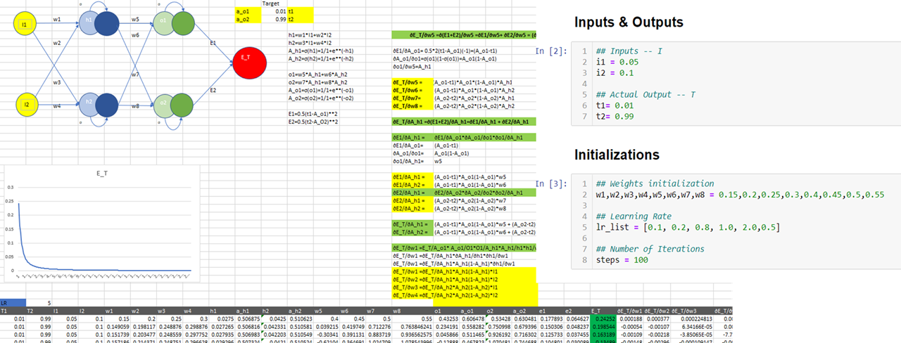
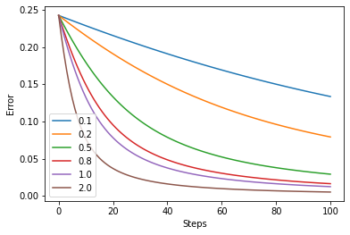
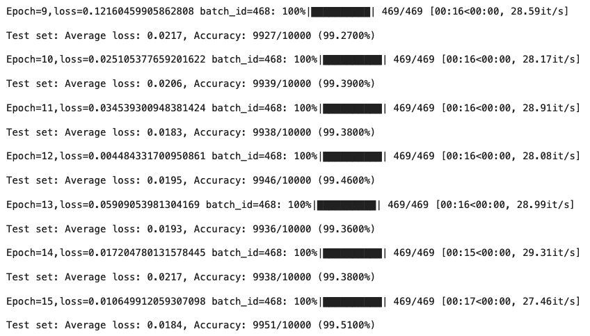

# TSAI - EVA8 Session 3 Assignment

## Problem Statement

1. PART 1[250]: Rewrite the whole excel sheet showing backpropagation. Explain each major step, and write it on Github.   
        1. Use exactly the same values for all variables as used in the class  
        2. Take a screenshot, and show that screenshot in the readme file  
        3. The Excel file must be there for us to cross-check the image shown on readme (no image = no score)  
        4. Explain each major step  
        5. Show what happens to the error graph when you change the learning rate from [0.1, 0.2, 0.5, 0.8, 1.0, 2.0]   
        6. Upload all this to GitHub and then write   all the above as part 1 of your README.md file.  
        7. Submit details to S3 - Assignment QnA.  
2. PART 2 [250]: We have considered many points in our last 4 lectures. Some of these we have covered directly and some indirectly. They are:  
        1. How many layers,  
        2. MaxPooling,  
        3. 1x1 Convolutions,  
        4. 3x3 Convolutions,  
        6. Receptive Field,  
        7. SoftMax,  
        8. Learning Rate,  
        9. Kernels and how do we decide the number of kernels?  
        10. Batch Normalization,  
        11. Image Normalization,  
        12. Position of MaxPooling,  
        13. Concept of Transition Layers,  
        14. Position of Transition Layer,  
        15. DropOut  
        16. When do we introduce DropOut, or when do we know we have some overfitting  
        17. The distance of MaxPooling from Prediction,  
        18. The distance of Batch Normalization from Prediction,  
        19. When do we stop convolutions and go ahead with a larger kernel or some other alternative (which we have not yet covered)
        How do we know our network is not going well, comparatively, very early  
        19. Batch Size, and effects of batch size
        etc (you can add more if we missed it here)  
3. Refer to this code: [COLABLINK](https://colab.research.google.com/drive/1uJZvJdi5VprOQHROtJIHy0mnY2afjNlx)  
        WRITE IT AGAIN SUCH THAT IT ACHIEVES  
            1. 99.4% validation accuracy
            2. Less than 20k Parameters  
            3. You can use anything from above you want.   
            4. Less than 20 Epochs  
            5. Have used BN, Dropout, a Fully connected layer, have used GAP.   
            6. To learn how to add different things we covered in this session, you can refer to this code: https://www.kaggle.com/enwei26/mnist-digits-pytorch-cnn-99 DONT COPY ARCHITECTURE, JUST LEARN HOW TO INTEGRATE THINGS LIKE DROPOUT, BATCHNORM, ETC. 
4. This is a slightly time-consuming assignment, please make sure you start early. You are going to spend a lot of effort into running the programs multiple times
5. Once you are done, submit your results in S3-Assignment-Solution  
6. You must upload your assignment to a public GitHub Repository. Create a folder called S3 in it, and add your iPynb code to it. THE LOGS MUST BE VISIBLE. Before adding the link to the submission make sure you have opened the file in an "incognito" window.  
7. If you misrepresent your answers, you will be awarded -100% of the score.  
8. If you submit Colab Link instead of notebook uploaded on GitHub or redirect the GitHub page to colab, you will be awarded -50% 
9. Submit details to S3 - Assignment QnA.  

# Part 1, Solution
## Q 1. Rewrite the whole excel sheet showing backpropagation. Explain each major step.
- [Excel Sheet](BackPropagation.xlsx)

## Q 1.a Use exactly the same values for all variables as used in the class


## Q 1.d Major Steps
Below are the defined major steps in this exercise  
   a. Initialization - Weights of the neural network are initialized as : w1 = 0.15, w2 = 0.2, w3 = 0.25, w4 = 0.3, w5 = 0.4, w6 = 0.45, w7 = 0.5, w8 = 0.55  
   b. Utility functions - Sigmoid Activation function  : This is used to squash all the values between 0 and 1  
   c. Forward propagation - Given the weights and inputs this function calculates the predicted output of the netowrk  
   d. Error Calculation - Calculate ```0.5* Squared Error``` between predicted output and target values  
   e. Gradient functions for each weights of the netowrk - These functions calculate the gradients of Error with respect to each weights in the network. This determines the direction and size of step we could take in the direction of minima. Two gradient functions are defined one for each layer. ```gradient_layer1``` function updates the weights that connect the input layer to the hidden layer. ```gradient_layer2``` function updates the weights that connect the hidden layer to output layer.     
   f. Updation of weights - We have incorporated updation of weights for each iteration in a ```for loop```. Each weight is updated by taking only a fraction of step size. The fraction here is defined using learning rate. Higher the learning rate greater the step we take. As a common practice learning rates are in the range between 0 to 1.    
   g. All the above steps are run for different learning rates in a for loop.   

## Q 1.e. Error graph with different learning rate [0.1, 0.2, 0.5, 0.8, 1.0, 2.0] 




Note
- With higher learning rate, we are reaching global minima for the weights faster. (assuming simple problem and the error function will be concave with one only minima)

# Part 2, Solution

Notebook: [link](EVA8_Session_3.ipynb)

Log of the loss function,  

