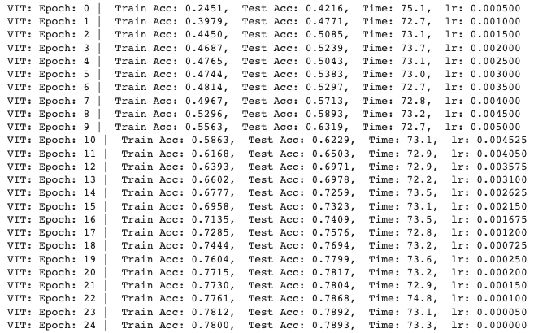

# TSAI - EVA8 Session 10 Assignment

## Problem Statement

Check out this [network](https://github.com/kentaroy47/vision-transformers-cifar10/blob/main/models/vit.py):

1. Re-write this network such that it is similar to the network we wrote in the class  
2. All parameters are the same as the network we wrote  
3. Proceed to submit the assignment:  
    1. Share the model code and link to the model cost  
    2. Share the training logs  
    3. Share the gradcam images for 10 misclassified images. 

## Solution

### Model
Modified model, [link](https://github.com/sujitojha1/pytorch-eva8/blob/main/models/ViT_Conv.py) 

### Training Logs

## Notes
- The model is highly sensitive to learning rate adjustments. A learning rate within the range of 0.01 to 0.005 facilitated effective learning, while other values resulted in the model becoming stuck with an accuracy of 0.1.
- The model head dimension significantly influences the model size and GPU load. A model head dimension of 4 demonstrated better performance when paired with a batch size of 128.