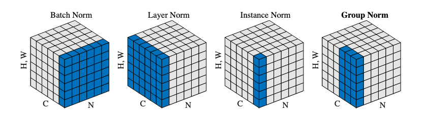

# TSAI - EVA8 Session 5 Assignment

## Problem Statement

1. You are making 3 versions of your 4th assignment's best model (or pick one from best assignments):  
    1. Network with Group Normalization  
    2. Network with Layer Normalization  
    3. Network with L1 + BN  
2. You MUST:  
    1. Write a single model.py file that includes GN/LN/BN and takes an argument to decide which normalization to include  
    2. Write a single notebook file to run all the 3 models above for 20 epochs each  
    3. Create these graphs:
        - Graph 1: Test/Validation Loss for all 3 models together  
        - Graph 2: Test/Validation Accuracy for 3 models together  
        - graphs must have proper annotation  
    4. Find 10 misclassified images for each of the 3 models, and show them as a 5x2 image matrix in 3 separately annotated images.  
    5. write an explanatory README file that explains:  
        - what is your code all about,  
        - how to perform the 3 normalizations techniques that we covered(cannot use values from the excel sheet shared)
        your findings for normalization techniques,  
        - add all your graphs  
        - your 3 collection-of-misclassified-images  
    6. Upload your complete assignment on GitHub and share the link on LMS  

## Solution

### Code Overview

This code aims to study the impact of various normalization techniques and L1 regularization on a CNN model trained on the CIFAR10 dataset. It includes the following features:

    - Data Loaders to load the CIFAR10 dataset.  
    - A modularized model that provides the option to select the type of normalization to be applied, either Batch Normalization (BN), Group Normalization (GN), or Layer Normalization (LN).  
    - A function to plot misclassified images to gain insight into the model's performance.  
    - Plots to visualize the training and test loss and accuracy during the training process.  

### Description of different Normalization techniques

These methods 

**Batch Normalization (BN):** This technique normalizes the activations for each mini-batch by subtracting the batch mean and dividing by the batch standard deviation. The mean and standard deviation values are computed for each feature map. This normalization is performed within the mini-batch and after every linear transformation in the network.

**Group Normalization (GN):** This technique is similar to Batch Normalization but instead of normalizing within each mini-batch, GN normalizes within a group of feature maps. The group size is a hyper-parameter that can be chosen depending on the GPU memory and computation resources.

**Layer Normalization (LN):** This technique normalizes the activations for each example, across all feature maps. This normalization is performed after every linear transformation in the network. LN is independent of mini-batch size and does not require batch statistics.