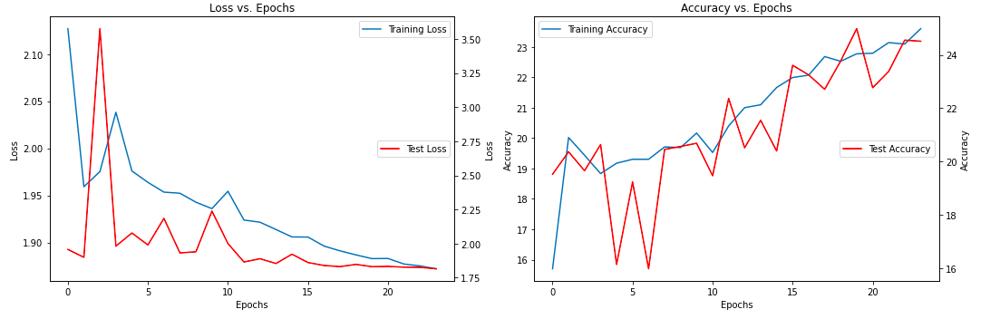
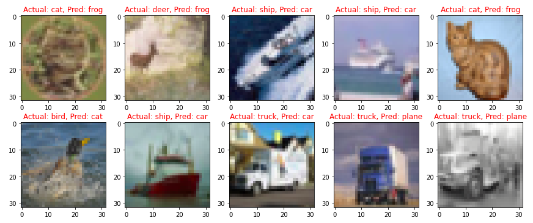

# TSAI - EVA8 Session 9 Assignment

## Problem Statement
Build the following network:

1. That takes a CIFAR10 image (32x32x3)  
2. Add 3 Convolutions to arrive at AxAx48 dimensions (e.g. 32x32x3 | 3x3x3x16 >> 3x3x16x32 >> 3x3x32x48)   
3. Apply GAP and get 1x1x48, call this X  
4. Create a block called ULTIMUS that:  
    1. Creates 3 FC layers called K, Q and V such that:  
        1. X*K = 48*48x8 > 8  
        2. X*Q = 48*48x8 > 8  
        3. X*V = 48*48x8 > 8  
    2. then create AM = SoftMax(QTK)/(8^0.5) = 8*8 = 8  
    3. then Z = V*AM = 8*8 > 8  
    4. then another FC layer called Out that:  
        1. Z*Out = 8*8x48 > 48  
5. Repeat this Ultimus block 4 times  
6. Then add final FC layer that converts 48 to 10 and sends it to the loss function.  
7. Model would look like this C>C>C>U>U>U>U>FFC>Loss  
8. Train the model for 24 epochs using the OCP that I wrote in class. Use ADAM as an optimizer.  
9. Submit the link and answer the questions on the assignment page:  
    1. Share the link to the main repo (must have Assignment 7/8/9 model7/8/9.py files (or similarly named))  
    2. Share the code of model9.py  
    3. Copy and paste the Training Log  
    4. Copy and paste the training and validation loss chart  

## Solution  

### Notebook & Model  
Training Notebook : [link](./EVA8_S9_CIFAR10_custom_model.ipynb) and Model [link](https://github.com/sujitojha1/pytorch-eva8/blob/main/models/model9.py)
Training accuracy: 23.6% and Test Accuracy: 24.51%

### Training/Test Loss and Accuracy  

### Misclassified Images

## Key Takeaways
- Acquired knowledge on the fundamental components of the transformer architecture, with a primary emphasis on the attention mechanism.
- The model's accuracy was limited due to insufficient model capacity and the absence of positional encoding.